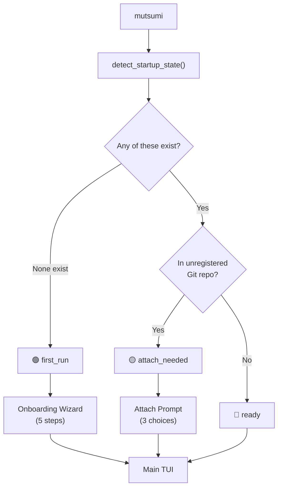

import { Aside } from '@astrojs/starlight/components';

## Overview

Every time you run `mutsumi`, the app inspects your environment and decides which of **three paths** to take. This happens instantly — there is no loading screen or spinner.



## The Three States

### 🔵 Ready — Direct Launch

**When:** Your environment is already set up.

**What Mutsumi checks:**
- `~/.mutsumi/config.toml` exists, **or**
- `~/.mutsumi/mutsumi.json` (personal tasks) exists, **or**
- `./mutsumi.json` or `./tasks.json` exists in current directory, **or**
- At least one project is registered in config, **or**
- `onboarding_completed` is `true` in config

If **any** of these conditions are true and the current directory doesn't need attachment, Mutsumi launches directly into the main TUI. No questions asked. This is the path for 99% of your launches after initial setup.

**What happens:**
1. Load config from `~/.mutsumi/config.toml`
2. Build source registry (personal + registered projects)
3. Start file watchers
4. Render the TUI

---

### 🟢 First Run — Onboarding Wizard

**When:** None of the "ready" conditions are met. This means:
- No `~/.mutsumi/config.toml`
- No `~/.mutsumi/mutsumi.json`
- No `./mutsumi.json` or `./tasks.json`
- No registered projects
- `onboarding_completed` is not set

In other words: Mutsumi has never been used before on this machine.

**What happens:**

A 5-step modal wizard appears:

| Step | Question | Default |
|------|----------|---------|
| 1 | **Language** — English / 中文 / 日本語 | System locale |
| 2 | **Input preset** — Arrows / Vim / Emacs | Arrows |
| 3 | **Theme** — Monochrome Zen / Nord / Dracula / Solarized | Monochrome Zen |
| 4 | **Workspace mode** — Personal only / Project only / Personal + project | Smart: Personal + project if in a Git repo, Personal only otherwise |
| 5 | **Agent integration** — Skip / Skills only / Skills + project doc | Skip |

After completing (or skipping) the wizard:
1. `~/.mutsumi/config.toml` is created with your choices
2. `~/.mutsumi/mutsumi.json` is created if you chose personal tasks
3. `./mutsumi.json` is created if you chose project tasks and you're in a Git repo
4. The project is registered in config if applicable
5. `onboarding_completed` is set to `true`
6. The main TUI launches

<Aside type="tip">
You can press **Escape** or click **Skip** at any time to skip the wizard. Mutsumi will launch with sensible defaults. You won't be asked again — the wizard only appears on first-ever launch.
</Aside>

---

### 🟡 Attach Needed — Project Prompt

**When:** All of these are true:
- You've already completed onboarding (`onboarding_completed = true`)
- You're inside a Git repository
- This repo is **not** registered as a project in config

This happens when you `cd` into a new project and run `mutsumi` for the first time there. Mutsumi knows you're an existing user and won't replay the full wizard — instead, it shows a lightweight prompt:

```
┌────────────────────────────────────────────────────┐
│          This folder looks like a project           │
│                                                     │
│  You already finished onboarding. Do you want to    │
│  attach this repo now?                              │
│                                                     │
│  [ Register project ]  [ Create local file ]  [ Skip ] │
└────────────────────────────────────────────────────┘
```

| Choice | What it does |
|--------|-------------|
| **Register project** | Adds this directory to `[[projects]]` in config. The existing `mutsumi.json` (if any) becomes a source. |
| **Create local file** | Creates `./mutsumi.json` with a template task **and** registers the project. |
| **Skip** | Does nothing. Mutsumi opens with your personal tasks only. You can always register later via `mutsumi project add .` |

<Aside type="note">
The attach prompt appears **at most once per repo**. After you register or skip, that repo won't trigger the prompt again.
</Aside>

---

## Detection Logic

Here's the exact decision tree used by `detect_startup_state()`:

```python
first_run = not any((
    config_exists,          # ~/.mutsumi/config.toml
    personal_exists,        # ~/.mutsumi/mutsumi.json
    project_file_exists,    # ./mutsumi.json or ./tasks.json
    bool(config.projects),  # any registered projects
    config.onboarding_completed,
))

if first_run:
    mode = "first_run"
elif config.onboarding_completed and in_git_repo and not registered:
    mode = "attach_needed"
else:
    mode = "ready"
```

## After Startup

Regardless of which path was taken, Mutsumi ends up in the same state:

- **Source registry** is built with all relevant sources (personal + projects)
- **File watchers** are active on all source paths
- **Main TUI** is rendered with the active tab

Any agent writing to `mutsumi.json` will trigger an instant re-render — whether you went through onboarding or launched directly.

## Re-running Onboarding

If you ever want to redo onboarding choices:

```bash
mutsumi init          # Force-create files and re-run setup
mutsumi setup --agent claude-code   # Reconfigure agent integration
```

These commands remain available as explicit utilities, but they are no longer prerequisites. The primary entrypoint is always just `mutsumi`.
