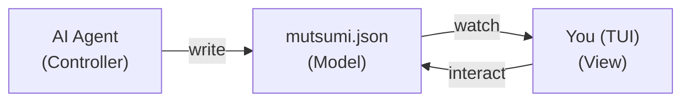

import { Card, CardGrid, Badge } from '@astrojs/starlight/components';

<Badge text="v0.4.0b1 Beta" variant="note" />

You don't need focus. You need to never lose a thread.

A dozen contexts a day — coding, reviewing, messaging, running agents, scanning feeds.
That's not a flaw. That's your operating mode. The problem is: the moment you switch away,
the last thread starts fading. Mutsumi keeps all your threads visible — summoned in a keystroke, gone in another.

```
┌─────────────────────────────────────────────────────┐
│  [★ Main] [Personal] [proj-a] [proj-b]   mutsumi ♪  │
├─────────────────────────────────────────────────────┤
│  ▼ HIGH ─────────────────────────────────────────   │
│  [ ] Refactor Auth module             dev,backend ★★★│
│  [x] Fix cache penetration bug        bugfix      ★★★│
│  ▼ NORMAL ───────────────────────────────────────   │
│  [ ] Write weekly report              life        ★★ │
│  [ ] Review PR #42                    dev         ★★ │
├─────────────────────────────────────────────────────┤
│  6 tasks · 2 done · 4 pending                       │
└─────────────────────────────────────────────────────┘
```

## Why Mutsumi?

<CardGrid>
  <Card title="Peripheral Vision" icon="open-book">
    Not center stage. Not hidden. She lives at the edge of your screen —
    one glance tells you every active thread and what your agents have pushed forward.
  </Card>
  <Card title="Agent-Driven" icon="puzzle">
    Claude Code, Codex CLI, Gemini CLI, Aider, or a shell script —
    your agents write tasks for you. You just glance and confirm.
  </Card>
  <Card title="Summon & Dismiss" icon="rocket">
    One hotkey to summon. One hotkey to dismiss. Quake-mode terminal,
    tmux popup, or a tiling split — she appears when you need her, vanishes when you don't.
  </Card>
  <Card title="Hackable" icon="setting">
    TOML config, custom themes, custom keybindings, Textual CSS overrides.
    Mod everything. Mutsumi loves being customized.
  </Card>
</CardGrid>

## How It Works



Your agents write JSON. Mutsumi watches and renders. You glance, confirm, and move on to the next thread.

## Quick Install

```bash
uv tool install git+https://github.com/ywh555hhh/Mutsumi.git
mutsumi
```
