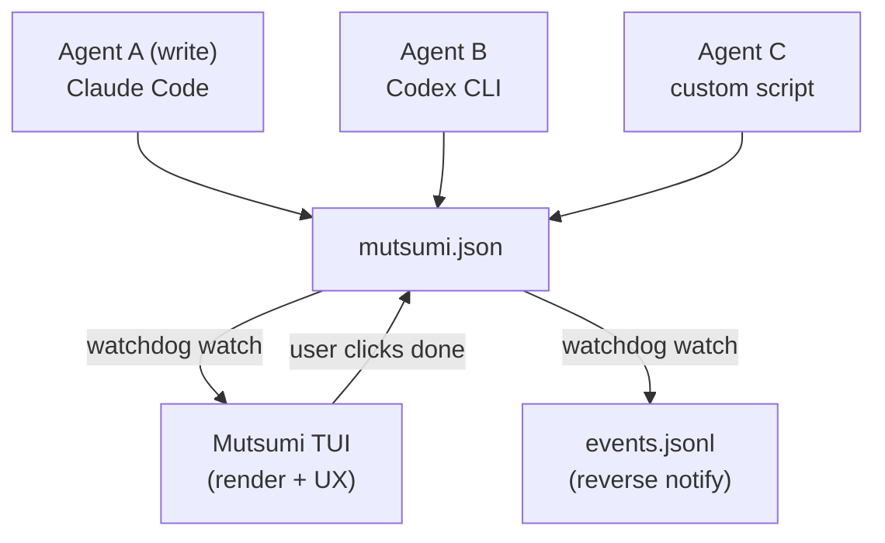
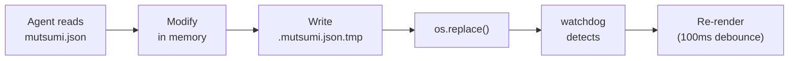
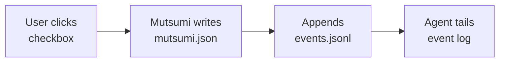

## System Diagram

## Component Breakdown

| Component | Responsibility | Technology |
|---|---|---|
| **TUI Renderer** | Render task list, handle user interaction | Textual |
| **File Watcher** | Watch mutsumi.json, trigger re-render | watchdog |
| **Data Layer** | Read/write mutsumi.json, schema validation | pydantic v2 |
| **CLI Interface** | Non-TUI command-line CRUD | click |
| **Config Loader** | Load user config | tomllib (stdlib) |
| **i18n Engine** | UI text multi-language switching | Custom dict-based |
| **Event Emitter** | Reverse-notify Agent via event log | File append-write |

## Technology Stack

| Layer | Choice | Rationale |
|---|---|---|
| Language | Python 3.12+ | Textual ecosystem, dev speed |
| Package Mgr | uv | Blazing fast, modern |
| TUI Framework | Textual | Mouse support, CSS-like styling |
| CLI Framework | click | Mature & stable |
| Validation | pydantic v2 | Type-safe JSON validation |
| File Watch | watchdog | Cross-platform, event-driven |
| Config Format | TOML | Human-readable, stdlib support |
| Distribution | uv tool install | Zero-dependency install |

## Data Flow

### Write Path (Agent → Mutsumi)

### Read Path (Mutsumi → Agent)

## Concurrent Write Strategy

| Scenario | Handling |
|---|---|
| TUI modifies | Read latest → modify → atomic write |
| Agent modifies | watchdog detects → reload → re-render |
| Simultaneous writes | Last Write Wins; self-heals on next trigger |
| JSON corruption | Error badge, retains last valid state |
