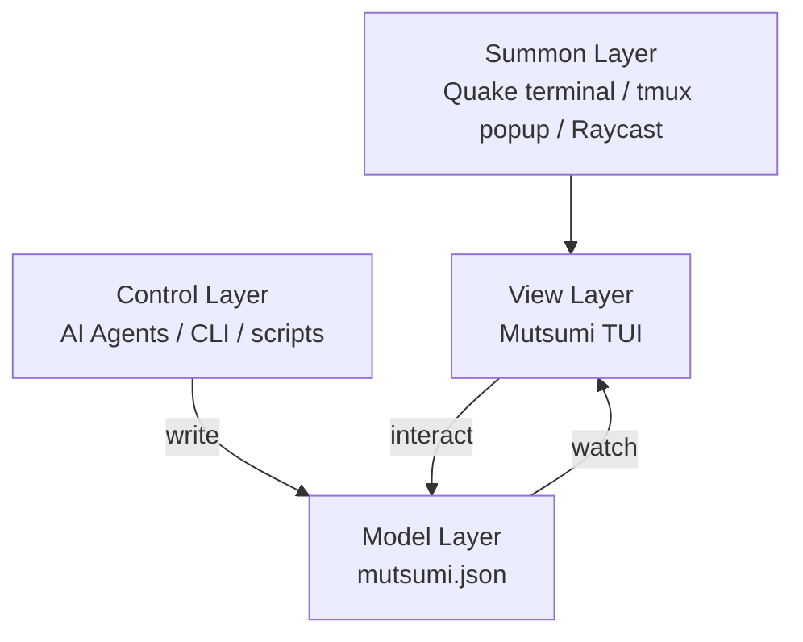

import { Aside, Card, CardGrid } from '@astrojs/starlight/components';

## You don't need focus. You need to never lose a thread.

"Focus" is last era's religion.

Today's developer switches between a dozen contexts every day — writing code, reviewing PRs, answering messages, running three agents, scanning feeds, writing reports. This isn't a deficiency. This is how you work. You are multi-threaded.

The real problem was never "you do too many things at once."

The real problem is: **the moment you switch away, the previous thread starts fading from your brain.**

An hour ago you had a critical bug to fix. Three context switches later, it's gone. Not because you lack discipline — because human working memory holds about 4 items, and you have 12 threads open.

## What Mutsumi Does

Mutsumi doesn't ask you to stop. Doesn't ask you to close your browser. Doesn't lecture you about "deep work."

She does one thing: **keeps all your threads visible in the corner of your eye, always.**

- Your AI agents write tasks into `mutsumi.json` as they work
- Mutsumi watches the file and re-renders instantly
- You glance, confirm direction, and continue to the next thread
- One hotkey to summon, one hotkey to dismiss

Switch contexts 40 times a day — it doesn't matter. Every time you glance back, you see exactly what's on your plate, what's waiting, what your agents have already pushed forward.

<Aside type="tip" title="Thread, not Task">
In Mutsumi's narrative, we say "thread" — an ongoing concern your brain needs to track. In the code and API, we say "task" — the data structure. Same thing, different lens.
</Aside>

## Where Mutsumi Fits

Mutsumi is **one component** in a zero-friction workflow:

| Layer | Role | Examples |
|-------|------|----------|
| **Summon** | Instant invocation | iTerm2 Quake, Windows Terminal Quake, guake, tmux popup |
| **View** | Visual thread table | **Mutsumi TUI** |
| **Control** | Thread creation | AI Agents, `mutsumi add`, shell scripts |
| **Model** | Persistent data | `mutsumi.json` — local, plain-text, Git-able |

She fills the View gap. The ecosystem provides the rest.

## Design Principles

<CardGrid>
  <Card title="1. Zero Friction" icon="rocket">
    From summon to action complete &lt; 2 seconds. No loading screen, no login, no network request.
  </Card>
  <Card title="2. Peripheral" icon="open-book">
    She lives at the edge of your vision. Not center stage. Not hidden. Like a clock on the wall.
  </Card>
  <Card title="3. Agent Agnostic" icon="puzzle">
    Not bound to any LLM or Agent. Any program that writes JSON is a legitimate Controller.
  </Card>
  <Card title="4. Hackable First" icon="setting">
    Users can trivially hack the data structure, theme, keybindings, and views.
  </Card>
</CardGrid>

**5. Local Only** — Zero network dependency. Data is files, files are local.

## Target User

**The Multi-threaded Individual:**

- Juggling browsers, chat groups, Reddit, Discord, forums simultaneously
- Running multiple agents on different tasks in parallel
- Terminal is the primary work environment
- Natural affinity for geek tools, loves DIY and customization

<Aside type="caution" title="NOT for">
- PMs who need team collaboration / shared boards (use Linear)
- Project managers who need Gantt charts (use Jira)
- Users who never touch a terminal (use Todoist)
</Aside>

## Name Origin

**Mutsumi (若叶睦)** — from the Japanese "睦" (harmony, closeness). She doesn't tell you what to do. She waits quietly, holding a sticky note covered with your threads. When you glance at her, she lifts the note a little higher. When you look away, she just waits there in peace.
