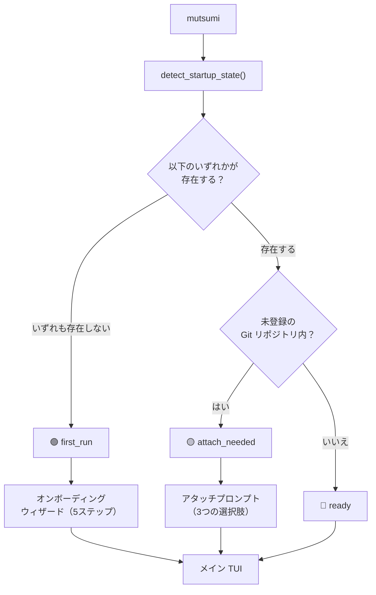

import { Aside } from '@astrojs/starlight/components';

## 概要

`mutsumi` を実行するたびに、アプリは環境を検査し、**3つのパス** のどれを取るか決定します。これは一瞬で完了します — ロード画面やスピナーはありません。



## 3つの状態

### 🔵 Ready — 直接起動

**条件：** 環境がすでにセットアップ済み。

**Mutsumi がチェックする項目：**
- `~/.mutsumi/config.toml` が存在する、**または**
- `~/.mutsumi/mutsumi.json`（個人タスク）が存在する、**または**
- カレントディレクトリに `./mutsumi.json` または `./tasks.json` が存在する、**または**
- 設定に少なくとも1つのプロジェクトが登録されている、**または**
- 設定で `onboarding_completed` が `true`

これらの条件のうち **いずれか** が true で、カレントディレクトリがアタッチを必要としなければ、Mutsumi はメイン TUI を直接起動します。質問なし。初回セットアップ後の起動の 99% はこのパスです。

**何が起きるか：**
1. `~/.mutsumi/config.toml` から設定を読み込み
2. ソースレジストリを構築（個人 + 登録済みプロジェクト）
3. ファイルウォッチャーを起動
4. TUI をレンダリング

---

### 🟢 First Run — オンボーディングウィザード

**条件：** 上記の「Ready」条件がすべて満たされない場合。具体的には：
- `~/.mutsumi/config.toml` がない
- `~/.mutsumi/mutsumi.json` がない
- `./mutsumi.json` も `./tasks.json` もない
- 登録済みプロジェクトがない
- `onboarding_completed` が設定されていない

つまり：このマシンで Mutsumi を使ったことがない。

**何が起きるか：**

5ステップのモーダルウィザードが表示されます：

| ステップ | 質問 | デフォルト |
|---------|------|-----------|
| 1 | **言語** — English / 中文 / 日本語 | システムロケール |
| 2 | **入力プリセット** — 矢印キー / Vim / Emacs | 矢印キー |
| 3 | **テーマ** — Monochrome Zen / Nord / Dracula / Solarized | Monochrome Zen |
| 4 | **ワークスペースモード** — 個人のみ / プロジェクトのみ / 個人 + プロジェクト | スマート：Git リポジトリ内なら「個人 + プロジェクト」、それ以外は「個人のみ」 |
| 5 | **Agent 統合** — スキップ / Skills のみ / Skills + プロジェクトドキュメント | スキップ |

ウィザード完了（またはスキップ）後：
1. `~/.mutsumi/config.toml` が作成され、選択内容が保存される
2. 個人タスクを選んだ場合、`~/.mutsumi/mutsumi.json` が作成される
3. プロジェクトタスクを選び、Git リポジトリ内にいる場合、`./mutsumi.json` が作成される
4. 必要に応じて、設定にカレントプロジェクトが登録される
5. `onboarding_completed` が `true` に設定される
6. メイン TUI が起動する

<Aside type="tip">
いつでも **Escape** を押すか **Skip** をクリックしてウィザードをスキップできます。Mutsumi は適切なデフォルト値で起動します。再度質問されることはありません — ウィザードは初回起動時のみ表示されます。
</Aside>

---

### 🟡 Attach Needed — プロジェクトアタッチプロンプト

**条件：** 以下のすべてが true：
- すでにオンボーディングを完了している（`onboarding_completed = true`）
- Git リポジトリ内にいる
- このリポジトリが設定にプロジェクトとして **未登録**

これは、新しいプロジェクトに `cd` して、そこで初めて `mutsumi` を実行したときに発生します。Mutsumi は既存ユーザーであることを認識し、完全なウィザードを再生しません — 代わりに、軽量なプロンプトを表示します：

```
┌──────────────────────────────────────────────────────┐
│       このフォルダはプロジェクトのようです              │
│                                                       │
│  すでにオンボーディングは完了しています。               │
│  このリポジトリをアタッチしますか？                     │
│                                                       │
│  [ プロジェクト登録 ]  [ ローカルファイル作成 ]  [ スキップ ] │
└──────────────────────────────────────────────────────┘
```

| 選択肢 | 動作 |
|--------|------|
| **プロジェクト登録** | カレントディレクトリを設定の `[[projects]]` に追加。既存の `mutsumi.json`（もしあれば）がソースになる。 |
| **ローカルファイル作成** | テンプレートタスク付きの `./mutsumi.json` を作成し、**同時に** プロジェクトを登録。 |
| **スキップ** | 何もしない。Mutsumi は個人タスクのみで開く。後からいつでも `mutsumi project add .` で登録可能。 |

<Aside type="note">
アタッチプロンプトは **リポジトリごとに最大1回** 表示されます。登録またはスキップ後、そのリポジトリでは再度トリガーされません。
</Aside>

---

## 検出ロジック

以下は `detect_startup_state()` の完全な判定ツリーです：

```python
first_run = not any((
    config_exists,          # ~/.mutsumi/config.toml
    personal_exists,        # ~/.mutsumi/mutsumi.json
    project_file_exists,    # ./mutsumi.json または ./tasks.json
    bool(config.projects),  # 登録済みプロジェクト
    config.onboarding_completed,
))

if first_run:
    mode = "first_run"
elif config.onboarding_completed and in_git_repo and not registered:
    mode = "attach_needed"
else:
    mode = "ready"
```

## 起動後

どのパスを経由しても、Mutsumi は同じ状態になります：

- **ソースレジストリ** に関連するすべてのソースが含まれる（個人 + プロジェクト）
- **ファイルウォッチャー** がすべてのソースパスでアクティブ
- **メイン TUI** がアクティブタブでレンダリング

Agent が `mutsumi.json` に書き込むと即座に再レンダリングがトリガーされます — オンボーディングを経由したか直接起動したかに関係なく。

## オンボーディングの再実行

設定をやり直したい場合：

```bash
mutsumi init          # ファイルを強制作成して再セットアップ
mutsumi setup --agent claude-code   # Agent 統合を再設定
```

これらのコマンドは引き続き使用可能ですが、前提条件ではなくなりました。メインのエントリポイントは常に `mutsumi` だけです。
