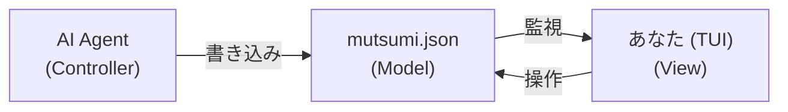

import { Card, CardGrid, Badge } from '@astrojs/starlight/components';

<Badge text="v0.4.0b1 Beta" variant="note" />

集中力は必要ありません。必要なのは、スレッドを落とさないことです。

1 日に十数回のコンテキストスイッチ — コーディング、PR レビュー、メッセージ返信、Agent 実行、情報収集。
これは欠点ではありません。これがあなたの動作モードです。問題は：切り替えた瞬間、前のスレッドが脳から薄れ始めること。
Mutsumi はすべてのスレッドを常に視界に置きます — ワンキーで呼び出し、ワンキーで退場。

```
┌─────────────────────────────────────────────────────┐
│  [★ Main] [Personal] [proj-a] [proj-b]   mutsumi ♪  │
├─────────────────────────────────────────────────────┤
│  ▼ HIGH ─────────────────────────────────────────   │
│  [ ] Refactor Auth module             dev,backend ★★★│
│  [x] Fix cache penetration bug        bugfix      ★★★│
│  ▼ NORMAL ───────────────────────────────────────   │
│  [ ] Write weekly report              life        ★★ │
│  [ ] Review PR #42                    dev         ★★ │
├─────────────────────────────────────────────────────┤
│  6 tasks · 2 done · 4 pending                       │
└─────────────────────────────────────────────────────┘
```

## なぜ Mutsumi なのか？

<CardGrid>
  <Card title="周辺視野" icon="open-book">
    画面の中央ではなく、隠れてもいない。視界の端にいて — 一瞥ですべてのスレッドと Agent の進捗がわかります。
  </Card>
  <Card title="Agent 駆動" icon="puzzle">
    Claude Code、Codex CLI、Gemini CLI、Aider、またはシェルスクリプト — Agent がタスクを書き込み、あなたは一瞥して方向を確認するだけ。
  </Card>
  <Card title="呼び出し＆退場" icon="rocket">
    ワンキーで呼び出し、ワンキーで退場。Quake ターミナル、tmux ポップアップ、タイリング分割 — 必要なときに現れ、不要なときに消えます。
  </Card>
  <Card title="カスタマイズ可能" icon="setting">
    TOML 設定、カスタムテーマ、カスタムキーバインド、Textual CSS オーバーライド。すべてを改造可能。Mutsumi はカスタマイズされるのが大好きです。
  </Card>
</CardGrid>

## 仕組み



Agent が JSON を書く。Mutsumi が監視して描画。あなたは一瞥し、方向を確認し、次のスレッドへ。

## インストール

```bash
uv tool install git+https://github.com/ywh555hhh/Mutsumi.git
mutsumi
```

[クイックスタート](/ja/getting-started/quick-start/)で最初のスレッドを始めましょう。
