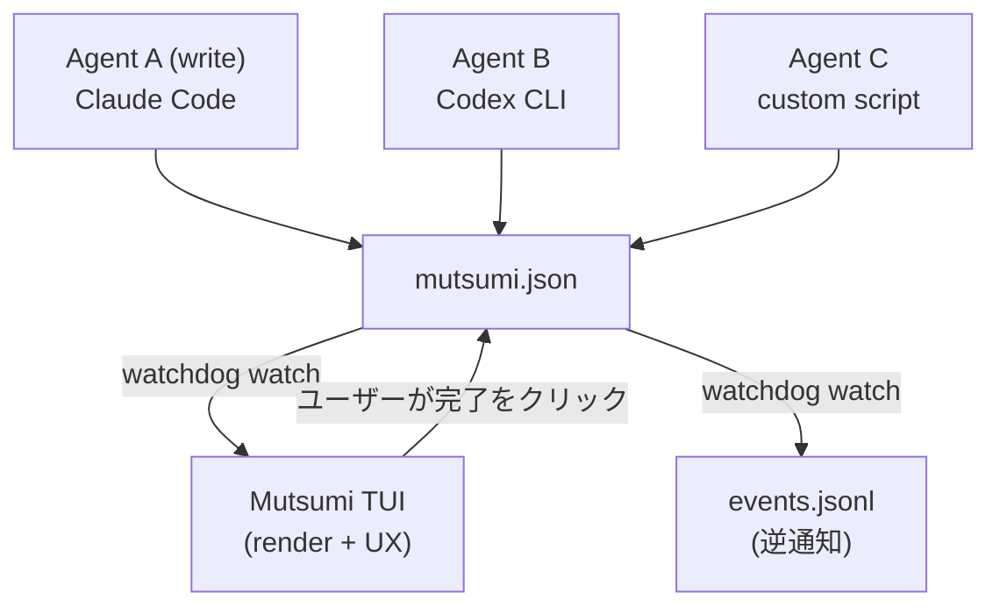
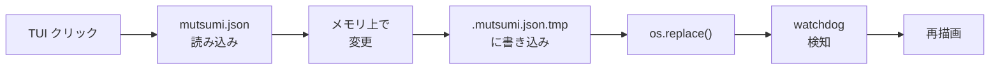
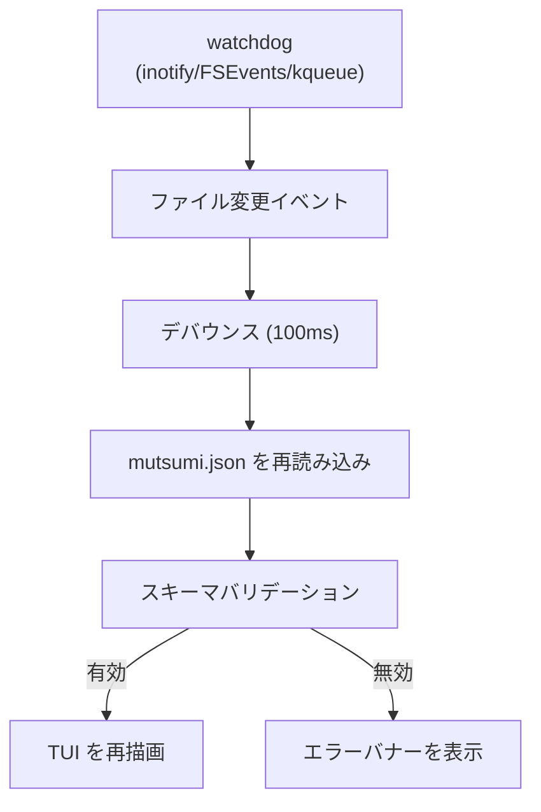

import { Aside, Card, CardGrid } from '@astrojs/starlight/components';

## システム構成図

Mutsumi のアーキテクチャは、複数の Agent が同時に `mutsumi.json` を操作し、TUI がリアルタイムに変更を反映するように設計されています。



## コンポーネント分解

| コンポーネント | 責務 | 技術 |
|---|---|---|
| **TUI レンダラー** | タスク一覧の描画、ユーザー操作の処理 | Textual (Python) |
| **ファイルウォッチャー** | `mutsumi.json` の変更を監視し再描画をトリガー | watchdog |
| **データレイヤー** | `mutsumi.json` の読み書き、スキーマバリデーション | Pydantic |
| **CLI インターフェース** | 非 TUI のコマンドライン CRUD | click |
| **設定ローダー** | ユーザー設定（テーマ、キーバインド、言語）の読み込み | tomllib (stdlib) |
| **i18n エンジン** | UI テキストの多言語切り替え | カスタム（シンプルな dict） |
| **イベントエミッター** | Agent への逆通知（オプション） | ファイル追記書き込み |

## 技術スタック

| レイヤー | 選択 | 理由 |
|---|---|---|
| 言語 | Python 3.12+ | Textual エコシステム、開発速度、`uv` とのゼロフリクション |
| パッケージマネージャ | uv | 高速、モダン、ギーク感にマッチ |
| TUI フレームワーク | Textual | マウスサポート、アニメーション、CSS ライクなスタイリング |
| CLI フレームワーク | click | 成熟 & 安定、Textual と衝突なし |
| バリデーション | Pydantic v2 | JSON スキーマバリデーション、高速、型安全 |
| ファイル監視 | watchdog | クロスプラットフォーム、成熟、イベント駆動 |
| 設定フォーマット | TOML | 人間可読、Python stdlib ネイティブサポート (tomllib) |
| 配布 | `uv tool install` | ゼロ依存のインストール体験 |

## ファイル構造

```
mutsumi/
├── app.py          # Textual App エントリーポイント
├── tui/            # TUI コンポーネント（ウィジェット）
├── cli/            # CLI コマンド（click）
├── core/           # データモデル、ファイル I/O、バリデーション
├── config/         # 設定読み込み & デフォルト値
├── i18n/           # ロケールファイル
└── themes/         # 内蔵テーマファイル
```

## データフロー

### 書き込みフロー（TUI → JSON）



`os.replace()` は POSIX システム上でアトミックであるため、半分書き込まれたファイルの読み取りを防ぎます。

### 読み取りフロー（JSON → TUI）



<Aside type="note">
デバウンス値はデフォルトで 100ms です。ファイル変更後、読み取り前に 100ms 待機します（書き込み完了を待つため）。100ms 以内の複数の変更は、一回の再読み取りにマージされます。
</Aside>

## セキュリティ & プライバシー

- **ゼロネットワーク**: Mutsumi はネットワークリクエストを一切行わず、テレメトリも含みません
- **ゼロクラウド**: すべてのデータはローカルファイルシステムに保存
- **ファイルパーミッション**: `mutsumi.json` は `0600`（所有者のみ読み書き可）推奨
- **eval 禁止**: `mutsumi.json` のフィールド内容を実行することは決してありません
