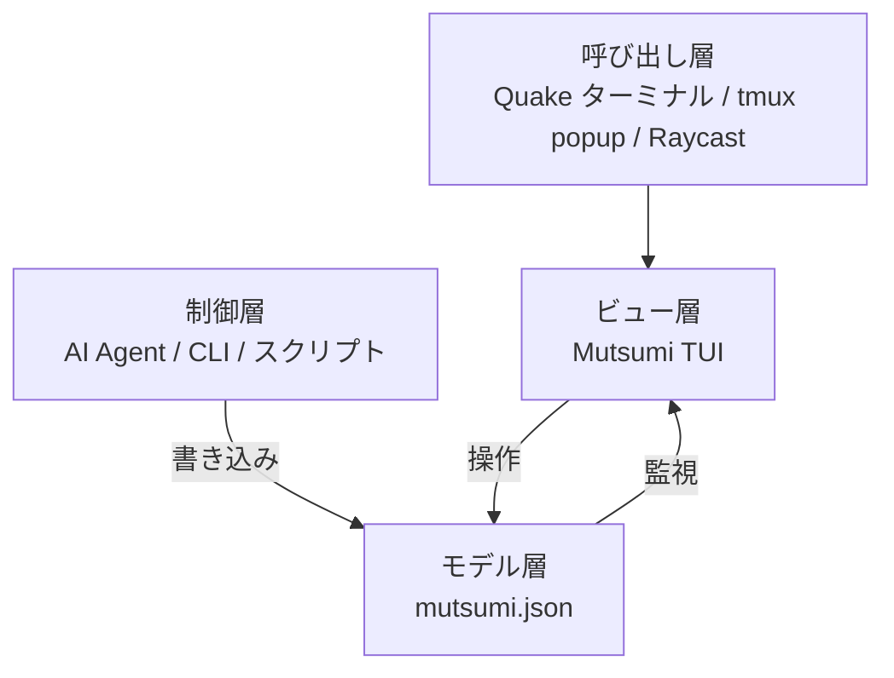

import { Aside, Card, CardGrid } from '@astrojs/starlight/components';

## 集中力は不要。スレッドを落とさなければいい。

「集中力」は前の時代の信仰です。

今日の開発者は 1 日に十数回のコンテキストスイッチを行います — コーディング、PR レビュー、メッセージ返信、3 つの Agent を実行、情報収集、週報作成。これは欠点ではありません。これがあなたの動作モードです。あなたはマルチスレッドなのです。

本当の問題は「同時に多くのことをやりすぎ」ではありません。

本当の問題は：**切り替えた瞬間、前のスレッドが脳から薄れ始めること。**

1 時間前に修正すべき重大なバグを思いついた。しかし 3 回のコンテキストスイッチ後、それは消えてしまった。自律心が足りないわけではない — 人間のワーキングメモリは約 4 スロットしかなく、あなたは 12 スレッドを開いているのです。

## Mutsumi がすること

Mutsumi は立ち止まれとは言いません。ブラウザを閉じろとも言いません。「フロー状態に入れ」とも言いません。

彼女がすることはただ一つ：**視界の片隅で、すべてのスレッドのリストを常に掲げていること。**

- AI Agent が作業中に `mutsumi.json` へタスクを自動書き込み
- Mutsumi がファイル変更を監視し即座に再描画
- あなたは一瞥して方向を確認し、次のスレッドへ
- ワンキーで呼び出し、ワンキーで退場

1 日に 40 回コンテキストスイッチしても構いません — 戻るたびに一瞥すれば、今手元に何があるか、何が待っているか、Agent が何を進めてくれたかがわかります。

<Aside type="tip" title="スレッド、タスクではなく">
Mutsumi のナラティブでは「スレッド」— あなたの脳が追跡し続ける必要がある関心事。コードと API では「タスク」— データ構造。同じものの異なるレンズです。
</Aside>

## Mutsumi の位置づけ

Mutsumi はゼロフリクション・ワークフローの中の**一つのコンポーネント**です：

| レイヤー | 役割 | 例 |
|---------|------|-----|
| **呼び出し** | 即座の起動 | iTerm2 Quake、Windows Terminal Quake、guake、tmux popup |
| **ビュー** | 視覚的スレッドテーブル | **Mutsumi TUI** |
| **制御** | スレッド作成 | AI Agent、`mutsumi add`、シェルスクリプト |
| **モデル** | 永続化データ | `mutsumi.json` — ローカル、プレーンテキスト、Git 対応 |

彼女はビュー層の空白を埋めます。エコシステムが残りを提供します。

## 設計原則

<CardGrid>
  <Card title="1. ゼロフリクション" icon="rocket">
    呼び出しからアクション完了まで 2 秒以内。ロード画面なし、ログインなし、ネットワークリクエストなし。
  </Card>
  <Card title="2. 周辺視野" icon="open-book">
    視界の端にいます。中央ではなく、隠れてもいない。壁の時計のように。
  </Card>
  <Card title="3. Agent 非依存" icon="puzzle">
    特定の LLM や Agent に縛られません。JSON を書けるあらゆるプログラムが正当な Controller です。
  </Card>
  <Card title="4. ハッカブル優先" icon="setting">
    データ構造、テーマ、キーバインド、ビュー — すべてカスタマイズ可能。
  </Card>
</CardGrid>

**5. ローカルオンリー** — ネットワーク依存ゼロ。データはファイル、ファイルはローカル。

## ターゲットユーザー

**マルチスレッドな個人：**

- ブラウザ、チャットグループ、Reddit、Discord、フォーラムを同時に遊泳
- 複数の Agent を異なるタスクで並行実行
- ターミナルが主要な作業環境
- ギークツールへの自然な親和性、DIY とカスタマイズが好き

<Aside type="caution" title="対象外">
- チーム共有ボードが必要な PM（→ Linear）
- ガントチャートが必要なプロジェクトマネージャー（→ Jira）
- ターミナルに触れないユーザー（→ Todoist）
</Aside>

## 名前の由来

**Mutsumi（若叶睦）** — 日本語の「睦」（調和・親密さ）から。彼女はあなたに何をすべきか指図しません。あなたのスレッドが書かれた付箋を持って、静かに待っています。あなたが一瞥すると、付箋を少し高く掲げます。目を逸らすと、ただ静かにそこにいます。
