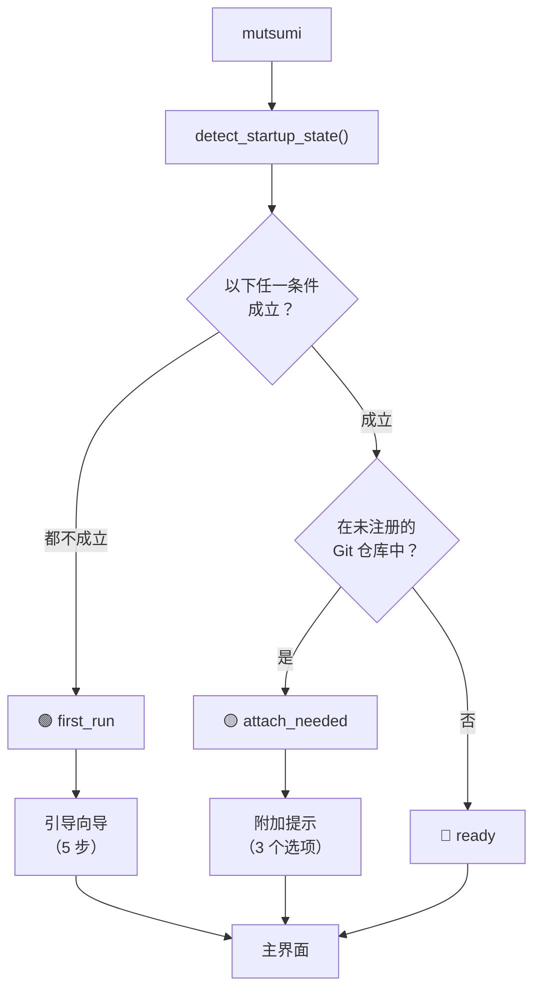

import { Aside } from '@astrojs/starlight/components';

## 概述

每次运行 `mutsumi`，应用会检查你的环境，决定走 **三条路径** 中的哪一条。这个过程是瞬间完成的 —— 没有加载画面，没有等待。



## 三种状态

### 🔵 Ready —— 直接启动

**触发条件：** 环境已就绪。

**Mutsumi 检查以下条件：**
- `~/.mutsumi/config.toml` 存在，**或**
- `~/.mutsumi/mutsumi.json`（个人任务）存在，**或**
- 当前目录有 `./mutsumi.json` 或 `./tasks.json`，**或**
- 配置中至少注册了一个项目，**或**
- 配置中 `onboarding_completed` 为 `true`

只要 **任一** 条件为 true，且当前目录不需要附加，Mutsumi 直接启动主界面。不问任何问题。这是初次设置后 99% 的启动路径。

**发生的事情：**
1. 从 `~/.mutsumi/config.toml` 加载配置
2. 构建数据源注册表（个人 + 已注册项目）
3. 启动文件监听器
4. 渲染 TUI

---

### 🟢 First Run —— 引导向导

**触发条件：** 以上所有「Ready」条件都不满足。具体来说：
- 没有 `~/.mutsumi/config.toml`
- 没有 `~/.mutsumi/mutsumi.json`
- 没有 `./mutsumi.json` 或 `./tasks.json`
- 没有注册过任何项目
- `onboarding_completed` 未设置

换句话说：这台机器上从未使用过 Mutsumi。

**发生的事情：**

弹出一个 5 步引导向导：

| 步骤 | 问题 | 默认值 |
|------|------|--------|
| 1 | **语言** — English / 中文 / 日本語 | 系统语言 |
| 2 | **输入方案** — 方向键 / Vim / Emacs | 方向键 |
| 3 | **主题** — Monochrome Zen / Nord / Dracula / Solarized | Monochrome Zen |
| 4 | **工作区模式** — 仅个人 / 仅项目 / 个人 + 项目 | 智能：在 Git 仓库中选「个人 + 项目」，否则选「仅个人」 |
| 5 | **Agent 集成** — 跳过 / 仅 Skills / Skills + 项目文档 | 跳过 |

完成（或跳过）向导后：
1. 创建 `~/.mutsumi/config.toml`，保存你的选择
2. 如果选了个人任务，创建 `~/.mutsumi/mutsumi.json`
3. 如果选了项目任务且在 Git 仓库中，创建 `./mutsumi.json`
4. 如有需要，在配置中注册当前项目
5. 设置 `onboarding_completed = true`
6. 启动主界面

<Aside type="tip">
你可以随时按 **Escape** 或点击 **Skip** 跳过向导。Mutsumi 会以合理的默认值启动。不会再次询问 —— 向导只在首次使用时出现。
</Aside>

---

### 🟡 Attach Needed —— 项目附加提示

**触发条件：** 以下条件同时满足：
- 你已经完成过引导（`onboarding_completed = true`）
- 你在一个 Git 仓库中
- 这个仓库 **未** 在配置中注册为项目

这发生在你 `cd` 到一个新项目，第一次在那里运行 `mutsumi` 的时候。Mutsumi 知道你是老用户，不会重放完整向导 —— 只弹一个轻量提示：

```
┌────────────────────────────────────────────────────┐
│           这个文件夹看起来是一个项目                  │
│                                                     │
│  你已经完成了引导。要把这个仓库附加到 Mutsumi 吗？   │
│                                                     │
│  [ 注册项目 ]      [ 创建本地文件 ]      [ 跳过 ]    │
└────────────────────────────────────────────────────┘
```

| 选项 | 效果 |
|------|------|
| **注册项目** | 把当前目录添加到配置的 `[[projects]]` 中。已有的 `mutsumi.json`（如果有）成为数据源。 |
| **创建本地文件** | 创建 `./mutsumi.json` 并附带模板任务，**同时** 注册项目。 |
| **跳过** | 不做任何操作。Mutsumi 只打开你的个人任务。以后可以随时通过 `mutsumi project add .` 注册。 |

<Aside type="note">
附加提示 **每个仓库最多出现一次**。注册或跳过后，该仓库不会再触发提示。
</Aside>

---

## 检测逻辑

以下是 `detect_startup_state()` 的完整判定树：

```python
first_run = not any((
    config_exists,          # ~/.mutsumi/config.toml
    personal_exists,        # ~/.mutsumi/mutsumi.json
    project_file_exists,    # ./mutsumi.json 或 ./tasks.json
    bool(config.projects),  # 任何已注册项目
    config.onboarding_completed,
))

if first_run:
    mode = "first_run"
elif config.onboarding_completed and in_git_repo and not registered:
    mode = "attach_needed"
else:
    mode = "ready"
```

## 启动之后

无论走了哪条路径，Mutsumi 最终都处于相同状态：

- **数据源注册表** 包含所有相关源（个人 + 项目）
- **文件监听器** 在所有源路径上激活
- **主界面** 渲染并展示当前活动标签页

任何 Agent 写入 `mutsumi.json` 都会触发即时重新渲染 —— 不管你是走了引导向导还是直接启动。

## 重新运行引导

如果想重新设置：

```bash
mutsumi init          # 强制创建文件并重新设置
mutsumi setup --agent claude-code   # 重新配置 Agent 集成
```

这些命令仍然可用，但不再是前置条件。主入口永远只是 `mutsumi`。
