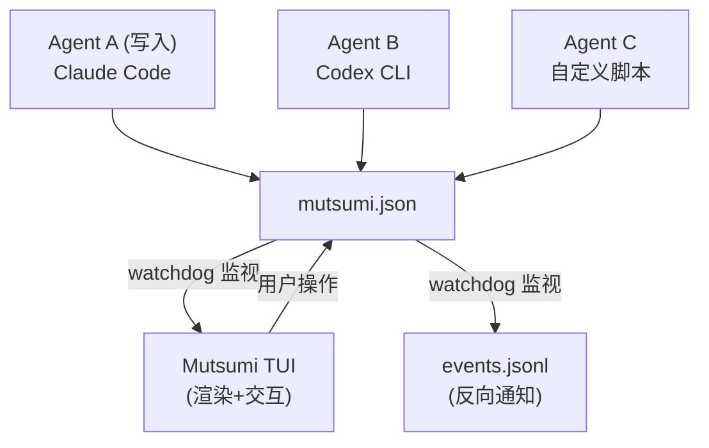
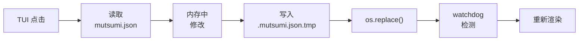

import { Aside } from '@astrojs/starlight/components';

## 系统架构图



多个 Agent 可以同时写入同一个 `mutsumi.json`，Mutsumi 通过 watchdog 检测文件变更并即时重新渲染。用户在 TUI 中的操作也会原子写回 JSON 文件。

## 组件分解

| 组件 | 职责 | 技术 |
|---|---|---|
| **TUI 渲染器** | 渲染任务列表，处理用户交互 | Textual (Python) |
| **文件监视器** | 监视 mutsumi.json 变更并触发重新渲染 | watchdog |
| **数据层** | 读写 mutsumi.json，Schema 校验 | Pydantic |
| **CLI 接口** | 提供非 TUI 模式的命令行 CRUD | click |
| **配置加载器** | 加载用户配置（主题、快捷键、语言） | tomllib (stdlib) |
| **i18n 引擎** | UI 文本多语言切换 | 自定义 (dict 映射) |
| **事件发射器** | 反向通知 Agent（可选） | 文件追加写入 |

## 技术栈

| 层级 | 选型 | 理由 |
|---|---|---|
| 语言 | Python 3.12+ | Textual 生态，开发速度快，uv 零摩擦 |
| 包管理 | uv | 极快、现代、符合极客审美 |
| TUI 框架 | Textual | 鼠标支持、动画、CSS 样式、代码量少 |
| CLI 框架 | click | 成熟稳定，与 Textual 无冲突 |
| 校验 | Pydantic v2 | JSON Schema 校验，极快，类型安全 |
| 文件监视 | watchdog | 跨平台、成熟、事件驱动 |
| 配置格式 | TOML | 人类可读，Python 标准库原生支持 (tomllib) |
| 分发 | uv tool install | 零依赖安装体验 |

<Aside type="note">
Python 3.12+ 标准库已内置 `tomllib`，无需额外安装 TOML 解析依赖。
</Aside>

## 文件结构

```
mutsumi/
├── app.py          # Textual App 入口
├── tui/            # TUI 组件（Widget）
├── cli/            # CLI 命令 (click)
├── core/           # 数据模型、文件 I/O、校验
├── config/         # 配置加载与默认值
├── i18n/           # 语言文件
└── themes/         # 内置主题文件
```

## 并发写入策略

| 场景 | 处理方式 |
|---|---|
| TUI 修改 → 写入 | 读取最新文件 → 修改目标字段 → 原子写入 (tmp + rename) |
| Agent 修改 → watchdog | 检测文件变更 → 重新加载 → 重新渲染 TUI |
| 同时写入（极少见） | Last Write Wins；TUI 在下次 watchdog 触发时自愈 |
| JSON 格式损坏 | TUI 显示错误标识，保留上次有效状态，绝不覆盖 |

原子写入流程：



`os.replace()` 在 POSIX 系统上是原子操作，防止读取到写了一半的文件。

## 安全与隐私

- **零网络**：Mutsumi 不发起任何网络请求，不包含遥测
- **零云端**：所有数据存储在本地文件系统
- **文件权限**：建议 mutsumi.json 权限设为 `0600`（仅所有者读写）
- **无 eval**：绝不执行 mutsumi.json 中任何字段的内容
