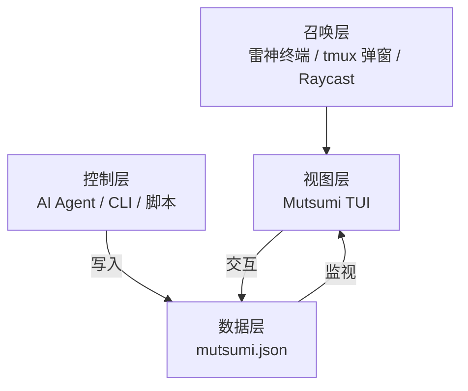

import { Aside, Card, CardGrid } from '@astrojs/starlight/components';

## 你不缺专注力。你缺的是一张不会丢的线程清单。

"你要学会专注。"——这句话在 2026 年听着像是在教鱼上树。

你每天在十几个上下文之间来回跳：写一会儿代码，切到群里回个消息，扫两眼 Reddit，让三个 Agent 各自干活，回头发现——刚才那个 bug 的线索断了。不是你不自律，是人脑的 working memory 就那么大，顶多同时端着四五件事，你却开着十二个线程。

**"专注"是让你关掉其他线程。Mutsumi 是让你哪个线程都不丢。**

这是两件完全不同的事。

## 她具体做了什么

Mutsumi 不会跳出来让你 "进入心流"，也不会给你倒计时施压。

她就干一件事：**在你余光能扫到的地方，永远举着一张清单——你手上有什么、哪些在等你、哪些 Agent 已经帮你往前推了。**

- Agent 干活的时候自动往 `mutsumi.json` 写任务
- Mutsumi 盯着这个文件，一有变化立刻刷新界面
- 你扫一眼确认方向，接着去忙下一件事
- 一个热键唤出来，一个热键收回去，比切标签页还快

一天切四十次上下文？没关系。每次回头瞟一眼，什么都没丢。

<Aside type="tip" title="线程 ≠ 任务？">
讲故事的时候我们说"线程"——你脑子里需要持续追踪的事。写代码和调 API 的时候我们说"任务"——JSON 里的数据结构。说的是同一件事，只是视角不同。
</Aside>

## 她在整个方案里的位置

Mutsumi 不是孤立的工具，她是一套零摩擦工作流里的**视图层**：

| 层 | 干什么 | 例子 |
|----|--------|------|
| **召唤** | 一键弹出终端 | iTerm2 雷神模式、Windows Terminal Quake、guake、tmux popup |
| **视图** | 把线程摆给你看 | **Mutsumi TUI** |
| **控制** | 建线程、改线程 | AI Agent、`mutsumi add`、shell 脚本 |
| **数据** | 存线程 | `mutsumi.json`——本地文件，纯文本，能进 Git |

她补的是视图层这个缺口。其他层你可以随便换。

## 几条底线

<CardGrid>
  <Card title="1. 零摩擦" icon="rocket">
    从唤出到干完事 2 秒以内。没有加载画面、没有登录、没有联网请求。
  </Card>
  <Card title="2. 余光可见" icon="open-book">
    不抢屏幕 C 位，也不会藏起来。就像墙上的钟——你需要看时间的时候它就在那。
  </Card>
  <Card title="3. 不绑 Agent" icon="puzzle">
    Claude Code、Codex CLI、Gemini CLI、写个 Python 脚本也行。能往 JSON 里写东西的，都是合法 Controller。
  </Card>
  <Card title="4. 随便改" icon="setting">
    数据格式、主题、快捷键、界面——全都能定制。Mutsumi 天生就是拿来被折腾的。
  </Card>
</CardGrid>

**5. 纯本地** —— 零联网。数据就是文件，文件就在你硬盘上。没有遥测，没有云端，没有后门。

## 给谁用的

**多线程选手：**

- 浏览器十几个标签页、三个群聊、Reddit 和 Discord 同时在线
- 好几个 Agent 分头干活
- 终端是主力工作台
- 喜欢折腾工具，越 geek 越来劲

<Aside type="caution" title="不适合">
- 需要团队看板的 PM——去用 Linear
- 需要甘特图的项目经理——去用 Jira
- 从不碰终端——去用 Todoist
</Aside>

## 为什么叫这个名字

**Mutsumi (若叶睦)** —— "睦"取自日语，意思是和谐、亲近。她不指挥你干活，就安静待在旁边，手里举着写满你线程的便签。你看她一眼，她把便签举高一点。你转过头去忙别的，她就在那等着。
